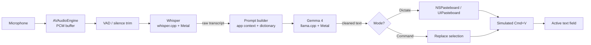

# Vox — Architecture

**Audience:** Engineers and AI agents building Vox.
**Companion docs:** [`../vox-prd-v1.md`](../vox-prd-v1.md), [`../vox-open-questions-resolved.md`](../vox-open-questions-resolved.md), [`ROADMAP.md`](ROADMAP.md), [`IMPLEMENTATION_PLAN.md`](IMPLEMENTATION_PLAN.md).

This document is the authoritative description of **how** Vox is built. The PRD describes **what** and **why**; this describes the mechanics.

---

## 1. System Context

```
                    ┌──────────────────────────────────────────┐
                    │               USER                        │
                    │  - Mac keyboard / mic                     │
                    │  - iPhone mic / Action Button             │
                    └──────┬───────────────────────────────┬────┘
                           │ speaks                        │ reads text at cursor
                           ▼                               ▲
        ┌───────────────────────────────────────────────────────────┐
        │                         VOX APP                           │
        │   (SwiftUI multiplatform; iOS 18+ / macOS 15+)            │
        │                                                           │
        │   ┌──────────┐   ┌──────────┐   ┌──────────┐              │
        │   │  Audio   │→  │   STT    │→  │   LLM    │→ Paste       │
        │   │  Capture │   │ Whisper  │   │  Gemma 4 │               │
        │   └──────────┘   └──────────┘   └──────────┘              │
        │                                                           │
        │   SwiftData · Keychain (BYOK) · App Group (iOS)           │
        └─────────────────────┬─────────────────────────────────────┘
                              │
                              │ (Phase 2, opt-in only)
                              ▼
               ┌──────────────────────────────┐
               │   BYOK Cloud LLM (optional)   │
               │   Gemini / OpenAI / Claude    │
               └──────────────────────────────┘
```

- **No default network traffic.** The cloud path exists for users who explicitly opt in with their own API key.
- Everything else runs on-device, accelerated by Metal (and later, optionally, the Apple Neural Engine via Core ML).

---

## 2. The Pipeline

### 2.1 Two-Stage (default)



**Latency budget (end-to-end, 10s utterance):**

| Stage | iPhone 16 (E2B) | M1 Mac (E4B) |
|-------|-----------------|--------------|
| Audio capture + VAD | < 50 ms | < 50 ms |
| Whisper small.en → medium.en | ~1.0 s → — | — → ~1.0 s |
| Gemma cleanup pass | ~0.8 s | ~0.6 s |
| Paste + return | < 100 ms | < 100 ms |
| **Total** | **~2.0 s** | **~1.7 s** |

### 2.2 Single-Stage "Lite Mode" (v1.1, opt-in)

Gemma 4 accepts audio directly via its audio encoder. Use when:

- RAM pressure is tight (older iPhone, 8GB Mac).
- User explicitly selects "Lite Mode" in Settings.

Trade-off: fewer model files, lower peak RAM, but noticeably worse STT accuracy in noisy or accented speech.

---

## 3. Runtime Topology

### 3.1 macOS

```
┌───────────────────────────────────────────────────────┐
│                    Main App (Vox.app)                 │
│  ┌─────────────────────────────────────────────────┐  │
│  │ @MainActor UI                                   │  │
│  │   - Menu bar controller (tray icon)             │  │
│  │   - Control panel window                        │  │
│  │   - Dictation overlay (floating pill)           │  │
│  │   - Preferences                                 │  │
│  └─────────────────────────────────────────────────┘  │
│  ┌─────────────────────────────────────────────────┐  │
│  │ PipelineActor (serial, non-main)                │  │
│  │   - Audio capture → STT → LLM → paste           │  │
│  │   - Owns loaded model handles                   │  │
│  └─────────────────────────────────────────────────┘  │
│  ┌─────────────────────────────────────────────────┐  │
│  │ Services                                        │  │
│  │   - HotkeyManager (Carbon / NSEvent monitor)    │  │
│  │   - PermissionsManager (Accessibility, Mic)     │  │
│  │   - ModelDownloadService                        │  │
│  │   - PasteService (Cmd+V synthesis)              │  │
│  │   - AppContextService (active app bundle ID)    │  │
│  └─────────────────────────────────────────────────┘  │
└───────────────────────────────────────────────────────┘
```

**Entitlements:** Accessibility, Microphone, Network (only for BYOK toggle + model download).

### 3.2 iOS (MVP: no keyboard extension)

```
┌───────────────────────────────────────────────────────┐
│                    Main App (Vox.app)                 │
│  Trigger: Action Button / Shortcut / Home Screen icon │
│  Same PipelineActor + Services as Mac                 │
│  Paste target: general pasteboard (user then paste)   │
└───────────────────────────────────────────────────────┘
```

### 3.3 iOS (v1.1: trampoline keyboard)

```
┌────────────────────┐       ┌──────────────────────────┐
│  VoxKeyboard (ext) │  URL  │         Vox.app          │
│  - Mic button      │──────▶│  - Inference pipeline    │
│  - Thin shell      │       │  - Writes text to        │
│  - Reads App Group │◀──────│    App Group container   │
│  - Pastes into     │ back  │  - Requests return to    │
│    text field      │       │    previous app          │
└────────────────────┘       └──────────────────────────┘
```

The keyboard extension itself never loads a model — iOS enforces a ~30–50MB limit on keyboard extensions. The main app does all the heavy lifting and hands text back via the App Group shared container.

---

## 4. Module Breakdown

Directory layout after Sprint 0:

```
Vox/
├── App/
│   ├── VoxApp.swift                 @main, scene config
│   ├── AppDelegate.swift            macOS menu bar
│   └── SceneDelegate.swift          iOS
├── Features/
│   ├── Dictation/
│   │   ├── DictationCoordinator.swift   State machine (idle → recording → processing → done)
│   │   ├── DictationOverlay.swift       SwiftUI floating pill
│   │   └── DictationHotkey.swift        macOS global hotkey
│   ├── CommandMode/
│   │   ├── CommandModeCoordinator.swift
│   │   └── CommandPrompts.swift
│   ├── History/
│   │   └── HistoryView.swift
│   ├── Settings/
│   │   ├── GeneralSettings.swift
│   │   ├── ModelSettings.swift
│   │   ├── DictionarySettings.swift
│   │   └── PrivacySettings.swift
│   └── Onboarding/
│       └── OnboardingFlow.swift
├── Pipeline/
│   ├── PipelineActor.swift          Owns STT + LLM lifecycle
│   ├── AudioCapture.swift           AVAudioEngine wrapper
│   ├── STTEngine.swift              Protocol + WhisperCppEngine
│   ├── LLMEngine.swift              Protocol + LlamaCppEngine
│   ├── PromptBuilder.swift          Cleanup / Command prompt templates
│   └── PasteService.swift           Cross-platform paste abstraction
├── Models/                           SwiftData entities
│   ├── Transcription.swift
│   ├── DictionaryEntry.swift
│   ├── Snippet.swift
│   ├── StyleProfile.swift
│   └── ModelConfig.swift
├── Services/
│   ├── ModelDownloadService.swift
│   ├── PermissionsManager.swift
│   ├── AppContextService.swift      Detect active app on macOS
│   ├── DeviceCapabilityService.swift ProcessInfo-based tier picker
│   └── KeychainService.swift        BYOK keys
├── UI/
│   ├── DesignSystem/                Colors, typography, spacing
│   └── Components/                  Waveform, shimmer, pill
└── Resources/
    ├── Prompts/
    │   ├── cleanup.system.txt
    │   └── command.system.txt
    └── Assets.xcassets
```

---

## 5. Key Interfaces

### 5.1 `STTEngine` protocol

```swift
protocol STTEngine: Sendable {
    func load(model: ModelConfig) async throws
    func transcribe(pcm: AudioBuffer, hints: [String]) async throws -> Transcript
    func unload() async
}

struct Transcript: Sendable {
    let text: String
    let segments: [Segment]
    let language: String
    let durationMs: Int
}
```

Implementations: `WhisperCppEngine` (Phase 1), `CoreMLWhisperEngine` (Phase 2).

### 5.2 `LLMEngine` protocol

```swift
protocol LLMEngine: Sendable {
    func load(model: ModelConfig) async throws
    func generate(prompt: Prompt, stops: [String], maxTokens: Int) async throws -> String
    func unload() async
}

struct Prompt: Sendable {
    let system: String
    let user: String
}
```

Implementations: `LlamaCppEngine` (Phase 1), `CoreMLGemmaEngine` (Phase 2 if conversion succeeds), `CloudLLMEngine` (Phase 2, BYOK).

### 5.3 `PipelineActor`

```swift
actor PipelineActor {
    private let stt: STTEngine
    private let llm: LLMEngine
    private let prompts: PromptBuilder

    func dictate(audio: AudioBuffer, context: AppContext) async throws -> String
    func command(selection: String, audio: AudioBuffer, context: AppContext) async throws -> String
}
```

Serial, non-MainActor. Only the coordinator awaits it.

---

## 6. Data Model (SwiftData)

See PRD §10 for the ER-style diagram. Summary:

- `Transcription` — raw, cleaned, app context, latency, model used.
- `DictionaryEntry` — user-added terms, with source (manual/auto-learned).
- `Snippet` — trigger phrase → expansion text.
- `StyleProfile` — rolling stats: avg sentence length, formality, vocab frequency.
- `ModelConfig` — downloaded model metadata (name, type, quantization, size, default flag).

Storage location:

- macOS: `~/Library/Application Support/llc.meridian.vox/`
- iOS: App Group container `group.llc.meridian.vox`

Model files under `…/models/`, never bundled in the app binary.

---

## 7. Device Capability & Tier Selection

At first launch `DeviceCapabilityService` picks the default tier:

| Total RAM | STT | LLM | Mode |
|-----------|-----|-----|------|
| ≥ 32 GB (Mac) | Whisper large-v3 | Gemma 4 E4B Q8_0 | Power |
| 16 GB (Mac) | Whisper medium.en | Gemma 4 E4B Q4_K_M | Default |
| 8 GB (iPhone 15 Pro / 16) | Whisper small.en | Gemma 4 E2B Q4_K_M | Default |
| < 8 GB | — | — | **Unsupported** |

User can override in Settings → Models. Downgrade is always allowed; upgrade only if the service finds sufficient headroom.

---

## 8. Permissions & Entitlements

| Platform | Permission / Entitlement | Why |
|----------|--------------------------|-----|
| macOS | Accessibility | Global hotkey, simulated Cmd+V, active app detection |
| macOS | Microphone (`NSMicrophoneUsageDescription`) | Audio capture |
| macOS | Hardened Runtime + App Sandbox | Notarization + App Store |
| iOS | Microphone | Audio capture |
| iOS | App Groups | Share models + output with keyboard extension (v1.1) |
| iOS | `RequestsOpenAccess` on keyboard | Mic access in extension (v1.1) |
| Both | Increased memory limit (iOS) | ML model loading on 8GB devices |
| Both | Keychain | BYOK API keys (Phase 2) |

Vox **never** requests: location, contacts, photos, tracking, background audio.

---

## 9. Privacy Architecture

1. **Audio buffers are ephemeral.** Freed immediately after STT completes. No on-disk audio cache.
2. **Transcripts are local.** SwiftData only. User can purge from Settings → Privacy.
3. **No telemetry / analytics.** Not even anonymous crash reports in v1.
4. **No third-party SDKs** with network access.
5. **BYOK opt-in only.** A visible banner, a Keychain-backed key, and clear "your request is leaving your device" messaging.
6. **Privacy manifest** declares mic usage, no tracking, no data collection.

The [`vox-privacy-audit`](../AGENTS.md#recommended-for-this-project-to-author) skill (to be authored) will enforce this via greps + CI.

---

## 10. Error & Failure Modes

| Failure | User-facing behavior | Internal handling |
|---------|----------------------|-------------------|
| Mic permission denied | One-tap Settings redirect | Coordinator returns `.permissionDenied` |
| Model not downloaded | Modal: "Download required (3.5GB)" | `ModelDownloadService` resumes |
| OOM during inference | "Your device is under memory pressure. Try Lite Mode." | Pipeline catches, unloads, surfaces |
| Silent recording | Subtle UI flash, no paste | VAD returns 0 segments |
| Whisper returns garbage | LLM prompt includes low-confidence hint; paste raw with warning if < threshold | |
| BYOK request fails (Phase 2) | Fall back to local engine, show banner | Retry policy: none. Users debug their key. |
| Jetsam kill | Next launch shows "Vox was interrupted. Restore last dictation?" | Persist partial state to SwiftData |

---

## 11. Cross-Cutting Concerns

- **Logging.** `os.Logger` with subsystem `llc.meridian.vox`. Categories: `pipeline`, `audio`, `stt`, `llm`, `ui`, `download`, `permissions`. **Never** log audio, transcripts, or cleaned text above `.debug`.
- **Feature flags.** `UserDefaults`-backed `FeatureFlags` struct; used for gradual Phase 2 rollout ("Lite Mode," "Command Mode beta").
- **Accessibility.** Dynamic Type everywhere. VoiceOver labels on dictation controls. High-contrast overlay.
- **Localization.** English only for MVP. Strings externalized via `String Catalog` (Xcode 15+) to ease future i18n.

---

## 12. Open Architectural Questions

Kept deliberately here rather than buried in PRD:

1. **Streaming Whisper.** Should Phase 2 move to streaming STT (chunked windows) to cut perceived latency? Cost: implementation complexity, possible accuracy regression.
2. **Core ML for Gemma 4.** If conversion is clean, ANE inference could cut iOS latency ~2x. If it's not, we stay on llama.cpp.
3. **Shared inference daemon on macOS.** A launch agent that keeps models warm, shared by the main app and (future) Shortcuts. Avoids cold-start cost. Security review needed.
4. **On-device fine-tune.** Using corrections as training data to fine-tune a small LoRA on Gemma. Deferred to Phase 3+; requires Metal-capable training path.

---

## 13. Diagrams

See [`diagrams/pipeline.md`](diagrams/pipeline.md) for the canonical Mermaid sources and additional flow diagrams.
