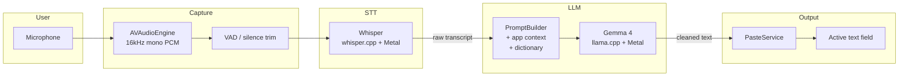
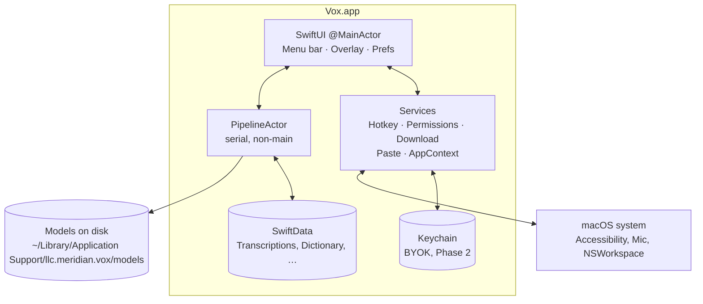
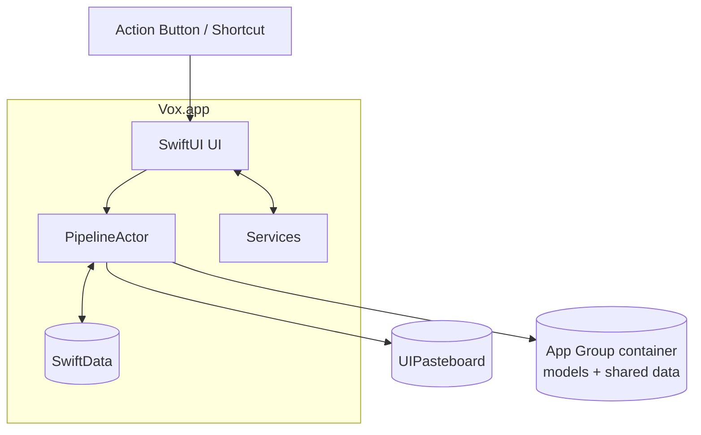
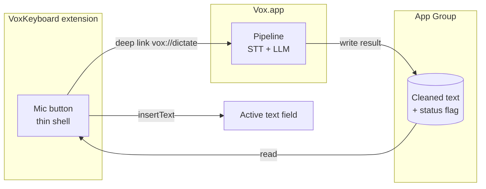
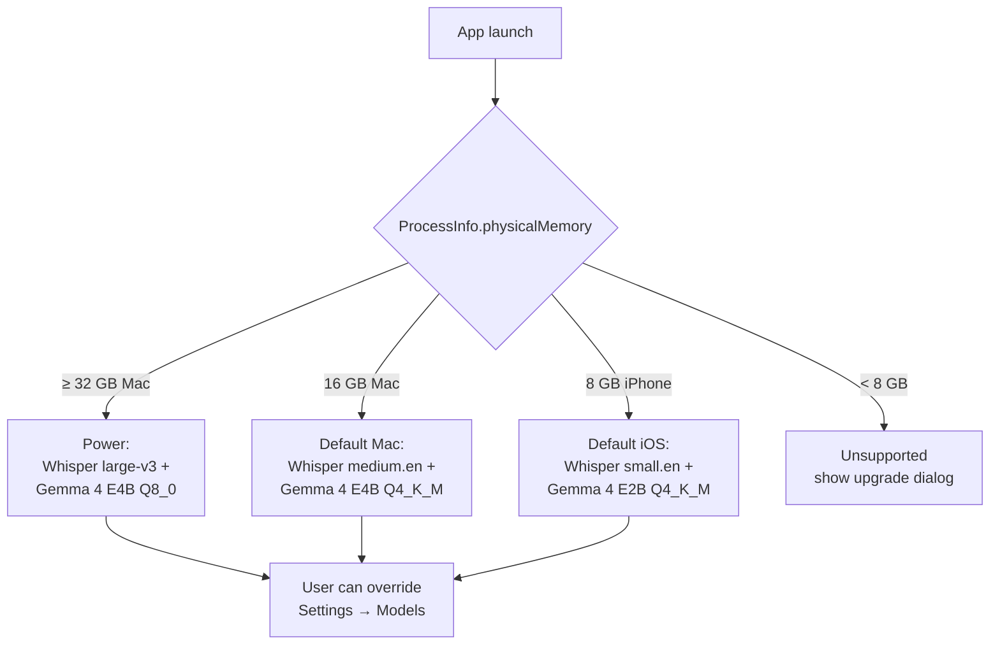
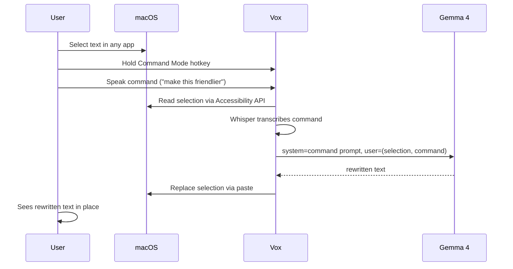
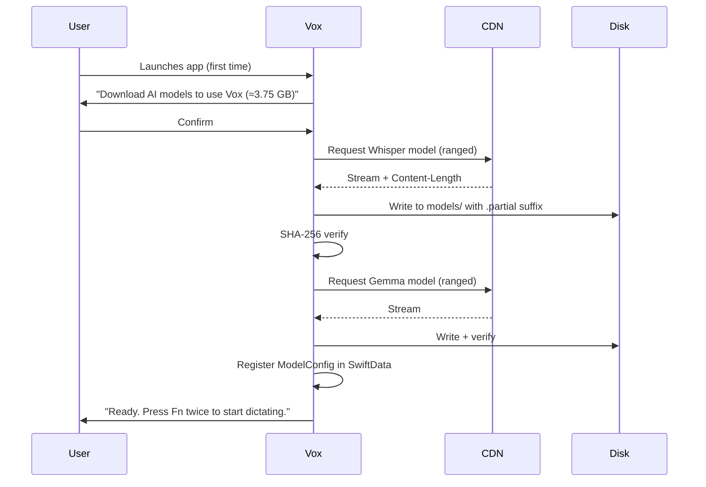

# Vox — Diagrams

Canonical source for Mermaid diagrams used throughout Vox docs. Rendered on GitHub and most Markdown tools.

---

## 1. End-to-End Dictation Pipeline (Two-Stage, default)

---

## 2. Runtime Topology — macOS

---

## 3. Runtime Topology — iOS (MVP, no keyboard extension)

---

## 4. Runtime Topology — iOS (v1.1, keyboard extension trampoline)

---

## 5. Model Tier Selection

---

## 6. Command Mode Flow

---

## 7. First-Launch Download

